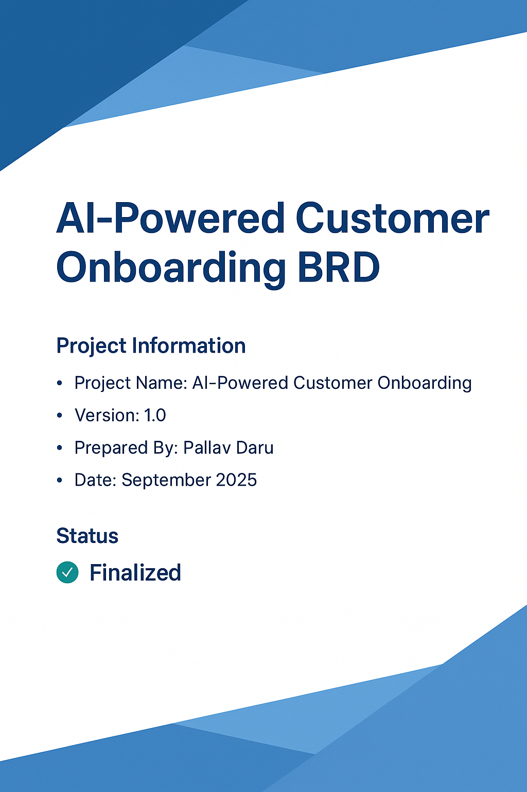

# AI-Powered Customer Onboarding (Demo BRD)

This repository demonstrates how Artificial Intelligence (AI) can be strategically applied in **retail banking onboarding** in India.  
It contains a structured **Business Requirements Document (BRD)**, process diagrams, and wireframes to showcase a techno-functional approach to problem solving.  

# 📘 AI-Powered Customer Onboarding BRD

This repository contains the **Business Requirements Document (BRD)** for the AI-Powered Customer Onboarding project.

## 📑 Table of Contents
- [01 Executive Summary](./BRD/01-Executive-Summary.md)
- [02 Current State Analysis](./BRD/02-Current-State-Analysis.md)
- [03 Future State Vision](./BRD/03-Future-State-Vision.md)
- [04 Detailed Requirements](./BRD/04-Detailed-Requirements.md)
- [05 Implementation Strategy](./BRD/05-Implementation-Strategy.md)
- [06 Non-Functional Requirements](./BRD/06-Non-Functional-Requirements.md)
- [07 Implementation Roadmap](./BRD/07-Implementation-Roadmap.md)
- [08 Change Management & Training](./BRD/08-Change-Management-&-Training.md)
- [09 Success Measurement & Monitoring](./BRD/09-Success-Measurement-&-Monitoring.md)
- [10 Ongoing Optimization](./BRD/10-Ongoing-Optimization.md)
- [11 Wireframes](./BRD/11-Wireframes.md)
- [12 Risk Assessment](./BRD/12-Risk-Assessment.md)
- [13 Assumptions & Dependencies](./BRD/13-Assumptions-&-Dependencies.md)
- [14 Stakeholders](./BRD/14-Stakeholders.md)
- [15 Glossary](./BRD/15-Glossary.md)
- [16 Appendices](./BRD/16-Appendices.md)
- [17 Document Control](./BRD/17-Document-Control.md)

## 🎯 Project Objective
- Reduce **onboarding dropouts** (currently up to 40% in digital channels).  
- Cut **manual KYC verification time** from 3–5 days to **<10 minutes**.  
- Enhance **fraud detection** using AI-powered document and face verification.  
- Deliver a seamless, secure, and regulatorily compliant customer journey.  

---

## 🛠️ Tools & Frameworks
- **Process Modeling** → Lucidchart, Draw.io  
- **Wireframes** → Figma, Balsamiq  
- **Documentation** → Markdown + PDF (GitHub friendly)  
- **AI Use Cases** → OCR, liveness detection, predictive dropout analytics  

---

## 📌 About this Project
This is a **demo BRD project** built for portfolio and learning purposes.  
It simulates real-world BA documentation practices, powered by AI insights.  

---

## 👤 Author
**Pallav Daru**  
Techno-Functional Analyst | AI-Powered Business Analyst (in progress)  
📍 Focus: Bridging business & technology with AI for strategic transformation  
